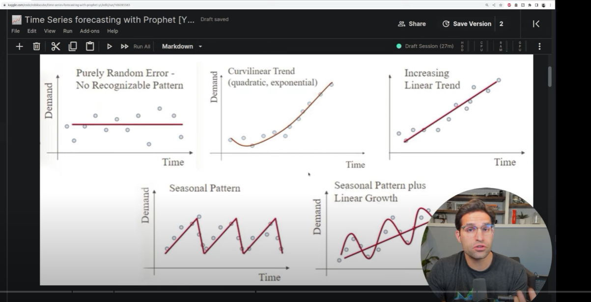

##
Ideas
##

Tipos de series de datos (diferentes patrones)

Demanda intermitente por la naturaleza del negocio, ejemplo aguachiles manu, que abre de miercoles a domingo

##
Referencias Bibliográficas
##

Bibliografia proyecto

Prophet
https://facebook.github.io/prophet/

Videos Youtube
- Nicolas Renotte
https://youtu.be/KvLG1uTC-KU?si=OREG4VKCzOykiZcg

- Aric LaBarr
https://youtu.be/2XFro0nIHQM?si=7N7KIImpjwJs0P4R

- Rob Mulla
https://youtu.be/j0eioK5edqg?si=rXKZlx1LP6_vQ3O4