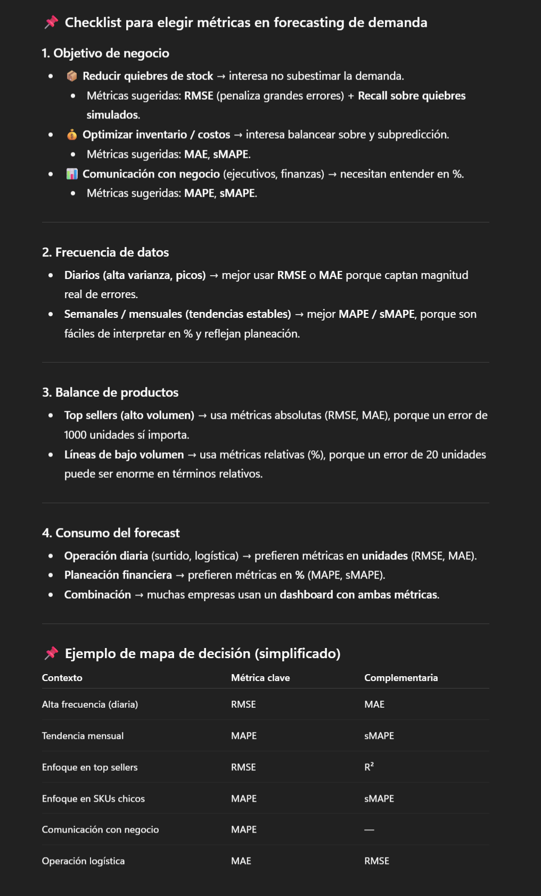
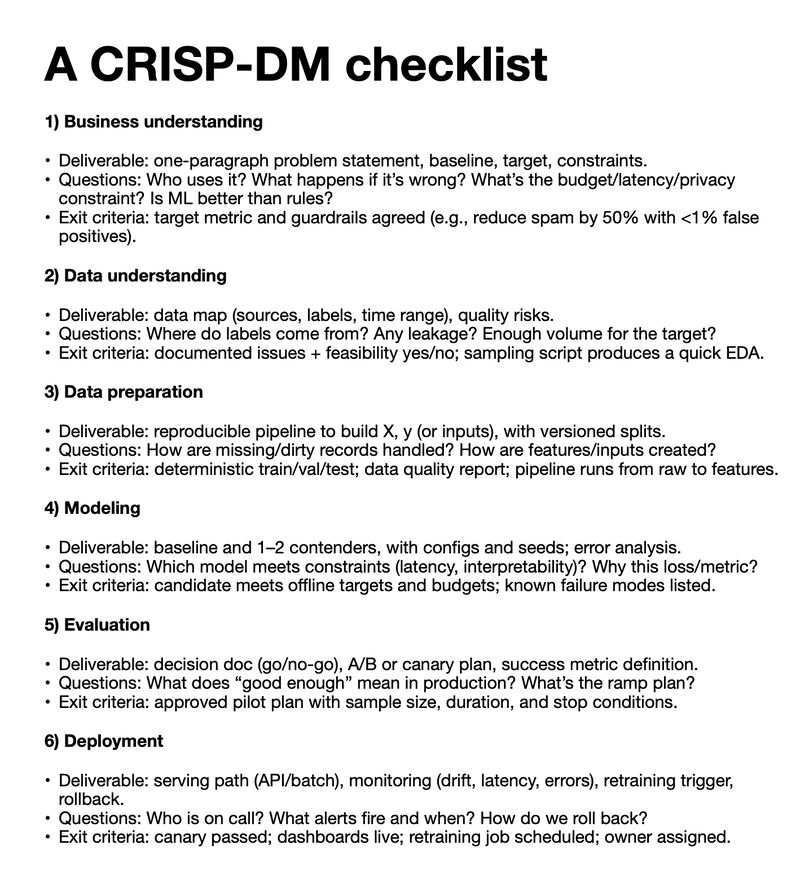
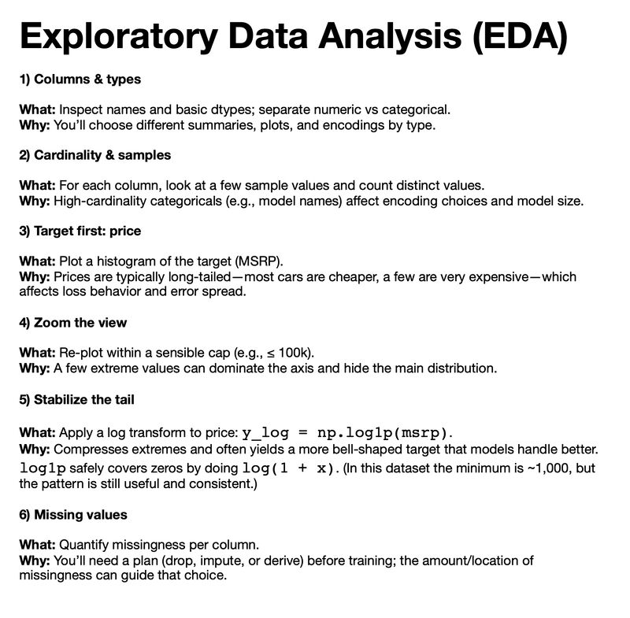
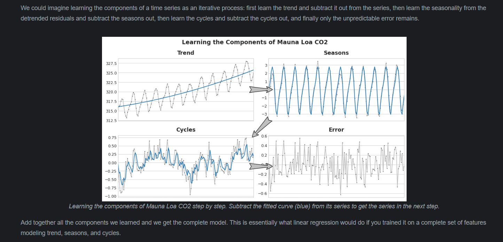
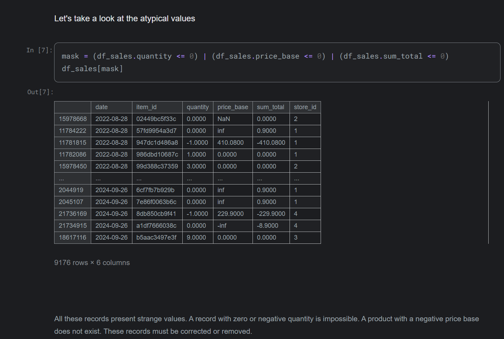

# Cross validation using time series split

Validación correcta para series de tiempo

Lo correcto es usar TimeSeriesSplit (scikit-learn) o un esquema manual de splits donde:

Siempre entrenas en datos anteriores.

Validas en datos posteriores (nunca usas datos futuros para predecir el pasado).

Ejemplo de esquema progresivo:

Fold 1: train = [meses 1–6], valid = [mes 7]

Fold 2: train = [meses 1–7], valid = [mes 8]

Fold 3: train = [meses 1–8], valid = [mes 9]

Y así sucesivamente.

Esto se conoce como expanding window (ventana creciente).
Otra variante es la sliding window, donde mantienes fija la longitud del train y vas desplazando (ej: train últimos 6 meses → valid siguiente mes).

---

Cómo conectar con CRISP-DM

Business Understanding
Ej: “Necesitamos predecir la demanda semanal de productos lácteos para reducir quiebres de stock en 15%”.

Data Understanding
Series de ventas históricas, calendario (festivos, promociones), precios, etc.

Data Preparation
Generación de lag features, ventanas móviles, variables exógenas (ej. clima, campañas).

Modeling
Probar CatBoost, XGBoost, Prophet, LSTM, etc.

Evaluation
Seleccionar métricas: RMSE para sensibilidad a errores grandes, MAPE/sMAPE para comunicar en % al negocio.

Deployment
Pipeline mensual/semanal con monitoreo de drift y dashboards de error en producción.

---

CRISP - DM checklist

---

EDA checklist

---

Nota sobre volatilidad y confianza en predicciones

Además de generar la predicción puntual de la variable objetivo, se incluirá un indicador de confianza basado en la volatilidad reciente (ej. desviación estándar móvil).

En baja volatilidad: se espera mayor certeza y menor error.

En alta volatilidad: la predicción se considera de riesgo alto, con mayor incertidumbre.

El plan contempla:

Calcular métricas de volatilidad (rolling std, coeficiente de variación).

Agregar estas métricas como features al modelo predictor.

Producir salidas enriquecidas: predicción + nivel de confianza (alta/baja).

Evaluar desempeño segmentado: comparar métricas de error en periodos de baja vs alta volatilidad para entender limitaciones y posibles mejoras futuras.

---

1) Features comunes de ventana en series de tiempo

Cuando generes rolling features para alimentar un modelo ML, considera:

Medidas de tendencia

rolling_mean (media móvil)

rolling_median (mediana móvil, más robusta a outliers)

Medidas de dispersión/variabilidad

rolling_std (desviación estándar)

coef_var = rolling_std / rolling_mean (variabilidad relativa)

rolling_mad (desviación absoluta mediana)

Medidas de extremos

rolling_min

rolling_max

rolling_range = max - min

Medidas de forma o dinámica

rolling_skew (asimetría de la distribución en la ventana)

rolling_kurt (curtosis, picos y colas)

rolling_trend (pendiente de regresión lineal dentro de la ventana → indica tendencia local)

Lag features (desplazamientos directos de la serie)

lag_1, lag_7, lag_30 (según periodicidad relevante)

2) Nota de justificación en el análisis del problema

El uso de features derivadas de ventanas temporales permite capturar patrones que un modelo de ML no vería en los datos crudos:

Tendencia y estacionalidad: la media y la pendiente local reflejan cómo evoluciona la serie.

Variabilidad: métricas como desviación estándar y coeficiente de variación muestran qué tan estable o volátil es el comportamiento en distintos periodos.

Riesgo y confianza en predicciones: incluir medidas de dispersión no solo mejora la capacidad predictiva del modelo, sino que habilita la generación de un nivel de certeza asociado a cada predicción.

👉 Esto justifica el uso de Machine Learning sobre métodos puramente estadísticos, ya que ML puede aprovechar múltiples descriptores de la serie en paralelo, integrando información de tendencia, variabilidad y estacionalidad para producir predicciones más ricas y útiles en entornos reales.

---

Resumen de la estrategia de forecasting jerárquico y mixto

Modelo Global → predice las ventas totales, útil para planeación financiera y logística.
Top Categorías → modelos específicos para las 3 categorías con mayor impacto en el negocio.
Top Productos → modelos individuales para los 3 productos más vendidos, donde la precisión es crítica.
Modelo Genérico (cola larga) → un modelo global para el resto de productos con ventas esporádicas, evitando la complejidad de entrenar modelos individuales.

Reconciliación → se mantiene consistencia entre los diferentes niveles (productos, categorías y total), asegurando que la suma de predicciones cuadre con el forecast global.

---

---
Remove strange values
